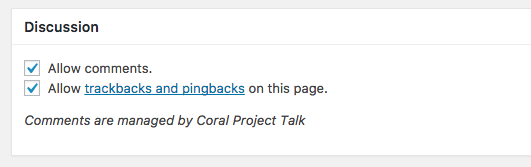

# Coral Project Talk

This plugin replaces standard WordPress commenting with [Talk](https://coralproject.net/products/talk.html) from the [Coral Project](https://coralproject.net).

## Setup

First, you'll need a server running your own instance of Talk. See the Talk [installation guide](https://github.com/coralproject/talk/blob/master/INSTALL.md) for more info about that.

Then...

1. Add the hostname of your WordPress site to the whitelist in the settings of your Talk instance.
1. Install and activate this plugin as you would any other WordPress plugin.
1. Go to `https://mysite.com/wp-admin/options-general.php?page=talk-settings`
1. Enter the URL of your Talk instance and click Save.

## HTTPS and Dev Mode

Your site must be served over `https` in order to integrate with Talk **unless** Talk is set to dev mode.

If you're installing Talk with Docker, you can do that by adding `NODE_ENV=dev` to the environment variables in your [`docker-compose.yml`](https://github.com/coralproject/talk/blob/master/INSTALL.md#installing). Otherwise, any method of setting `process.env.NODE_ENV = 'dev'` will do the trick.

## Theme usage

If your theme uses WordPress' standard `comments_template()` to render comments forms, the output will be overridden by the Talk embed code.

If you are building a custom theme, we recommend using `coral_talk_comments_template()` instead of the usual `comments_template()` for performance reasons.

Note that comments can still be turned on or off for an invidual post:



[`comments_open()`](https://codex.wordpress.org/Function_Reference/comments_open) will still work when Coral Project Talk is active, but other functions like [`get_comments_number()`](https://codex.wordpress.org/Template_Tags/get_comments_number) that reference the `wp_comments` database table may not.

We recommend something like:

```
if ( comments_open() ) {
	coral_talk_comments_template();
}
```

## Version
Talk version <= `v3.9.1` use wp-talk-plugin `v0.0.6`

Talk version >= `4.0.0` use wp-talk-plugin `v0.1.0`
